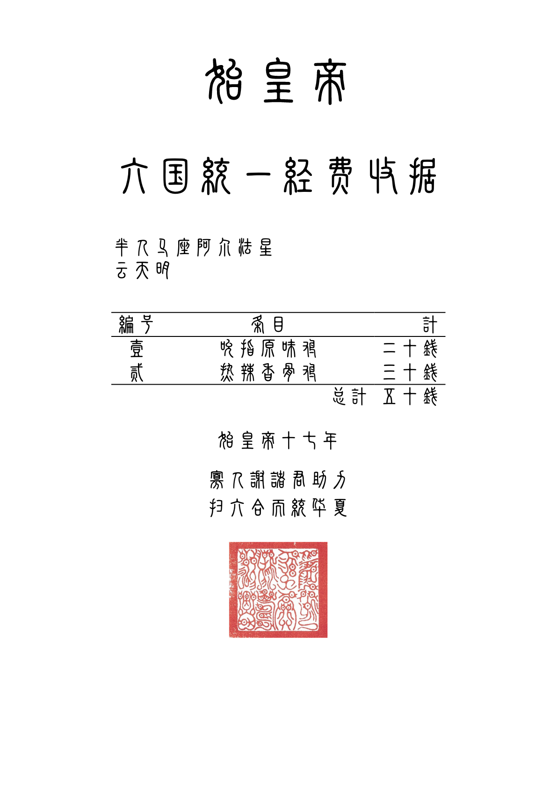

  <picture>
    
  </picture>

## 使用

- VSCode 安装 [Tinymist Typst](https://marketplace.visualstudio.com/items?itemName=myriad-dreamin.tinymist) 插件
- 编辑 `data.json` 中的的对应字段
- 预览 `main.typ` 并导出

## 字体

需要安装：[三极小篆简](https://www.fonts.net.cn/font-39567254338.html)

## 效果

致谢：
- 该模版参考了 [erictapen/typst-invoice](https://github.com/erictapen/typst-invoice) 的实现